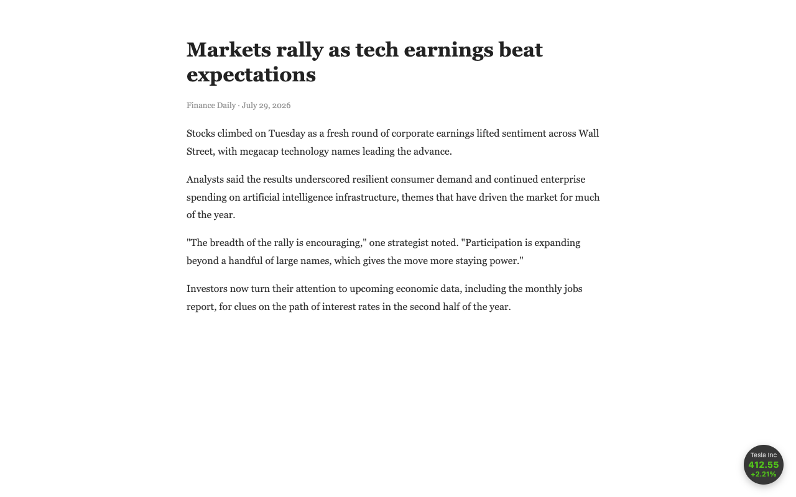
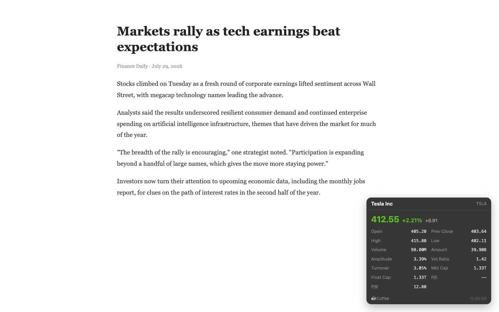
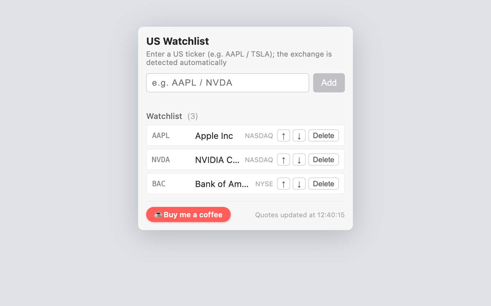

# US Stock Watchlist Floater

A lightweight Chrome extension that keeps an eye on your US stocks without leaving the page you're on — a tiny floating ball rotates through your watchlist with live prices, and expands into a full quote panel on hover.

## Features

- **Floating circle** on every page that cycles through your watchlist every few seconds — no tab switching, no distractions
- **Hover to expand** a detail panel with 13 indicators: open, previous close, high/low, volume, amount, amplitude, volume ratio, turnover, market cap, float cap, P/B and more
- **Draggable** — place the ball anywhere; it remembers its position
- **Edge-aware** — the expanded panel always stays on screen, flipping direction near window edges
- **Auto refresh** every few seconds
- **Any US ticker** (AAPL, TSLA, NVDA…) — NASDAQ, NYSE and AMEX are detected automatically
- **US color convention**: green up, red down
- **Privacy-friendly**: watchlist stored locally only; no accounts, no tracking, no analytics

## Install

### From Chrome Web Store

*(coming soon — link will be added after review)*

### Manual (developer mode)

1. Download or clone this repository
2. Open `chrome://extensions` in Chrome (or `edge://extensions` in Edge)
3. Enable **Developer mode** (top right)
4. Click **Load unpacked** and select this folder

## Usage

1. Click the extension icon to open the watchlist manager
2. Type a US ticker (e.g. `AAPL`) and press Add — the company name and exchange are resolved automatically
3. The floating ball appears at the bottom-right of any page; drag it wherever you like
4. Hover the ball to see the full quote panel

## How it works

- Quote data comes from a public market-data API (Eastmoney `push2` endpoints); quotes may be delayed
- A background service worker refreshes quotes every ~6 seconds via `chrome.alarms`
- A content script renders the floating widget; watchlist and position are kept in `chrome.storage.local`

## Privacy

The extension collects no personal data. Your watchlist never leaves your browser. See [PRIVACY.md](publishing/PRIVACY.md).

## Disclaimer

Quotes may be delayed and are provided for reference only. Nothing here is investment advice.

## Support

Free and open source. If it helps you, consider buying me a coffee:

**[☕ ko-fi.com/forever1252](https://ko-fi.com/forever1252)**

## License

MIT
